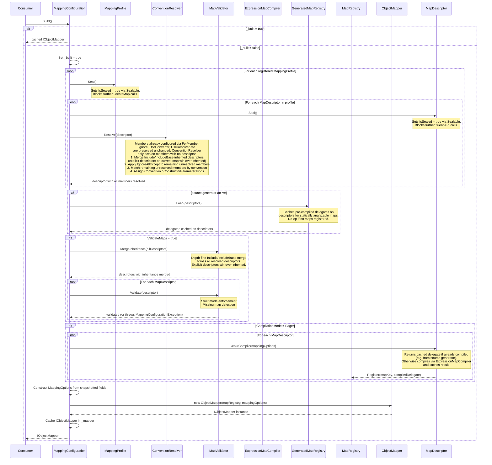

# Design Document
## C# Class Library: Polymorph
**Status:** Draft
**Version:** 0.1
**Requires:** REQUIREMENTS.md v0.1

---

- [Introduction](#introduction)
- [1. Internal Package Structure](#1-internal-package-structure)
  - [1.1 Assembly Topology](#11-assembly-topology)
  - [1.2 Internal Namespaces](#12-internal-namespaces)
  - [1.3 InternalsVisibleTo Configuration](#13-internalsvisibleto-configuration)
  - [1.4 Internal Type Inventory](#14-internal-type-inventory)
  - [1.5 Component Relationships](#15-component-relationships)
  - [1.6 Build() Sequence Diagram](#16-build-sequence-diagram)
- [2. Strong Naming](#2-strong-naming)
  - [2.1 Approach](#21-approach)
  - [2.2 Repository Contents](#22-repository-contents)
  - [2.3 Project File Configuration](#23-project-file-configuration)
  - [2.4 Consistency Requirement](#24-consistency-requirement)
- [3. Registration Pipeline](#3-registration-pipeline)
  - [3.1 Overview](#31-overview)
  - [3.2 MappingProfile Construction](#32-mappingprofile-construction)
  - [3.3 MappingConfiguration Initialization](#33-mappingconfiguration-initialization)
  - [3.4 Profile Registration](#34-profile-registration)
  - [3.5 Map Descriptor Construction](#35-map-descriptor-construction)
  - [3.6 Validation](#36-validation)
  - [3.7 Build and Immutability Enforcement](#37-build-and-immutability-enforcement)
  - [3.8 Post-Build State](#38-post-build-state)
- [4. MappingContext Lifecycle](#4-mappingcontext-lifecycle)
  - [4.1 Purpose and Scope](#41-purpose-and-scope)
  - [4.2 Creation](#42-creation)
  - [4.3 Propagation](#43-propagation)
  - [4.4 Depth Tracking and Circular Reference Detection](#44-depth-tracking-and-circular-reference-detection)
  - [4.5 Collection Mapping Scoping](#45-collection-mapping-scoping)
  - [4.6 Source Generator Path](#46-source-generator-path)
  - [4.7 Disposal and Cleanup](#47-disposal-and-cleanup)
- [5. Mapping Engine](#5-mapping-engine)
  - [5.1 Expression Tree Engine](#51-expression-tree-engine)
    - [5.1.1 Map Representation](#511-map-representation)
    - [5.1.2 Convention Resolution](#512-convention-resolution)
    - [5.1.3 Compilation Pipeline](#513-compilation-pipeline)
    - [5.1.4 Nested Map Handling](#514-nested-map-handling)
    - [5.1.5 Reverse Map Compilation](#515-reverse-map-compilation)
    - [5.1.6 Include and IncludeBase Resolution](#516-include-and-includebase-resolution)
  - [5.2 Source Generator Engine](#52-source-generator-engine)
    - [5.2.1 Profile Analysis](#521-profile-analysis)
    - [5.2.2 Statically Analyzable Subset](#522-statically-analyzable-subset)
    - [5.2.3 Code Emission](#523-code-emission)
    - [5.2.4 Reverse Map and Inheritance Emission](#524-reverse-map-and-inheritance-emission)
    - [5.2.5 Runtime Integration](#525-runtime-integration)
  - [5.3 Compilation Model and Dispatch](#53-compilation-model-and-dispatch)
    - [5.3.1 Map Registry](#531-map-registry)
    - [5.3.2 Typed Dispatch](#532-typed-dispatch)
    - [5.3.3 Untyped Dispatch](#533-untyped-dispatch)
    - [5.3.4 Collection Dispatch](#534-collection-dispatch)
    - [5.3.5 Eager vs. Lazy Compilation](#535-eager-vs-lazy-compilation)
- [6. Extension Points](#6-extension-points)
  - [6.1 Decision Guide](#61-decision-guide)
  - [6.2 ITypeConverter Invocation](#62-itypeconverter-invocation)
  - [6.3 IValueConverter Invocation](#63-ivalueconverter-invocation)
  - [6.4 IMemberValueResolver Invocation](#64-imembervalueresolver-invocation)
  - [6.5 Instantiation and Caching](#65-instantiation-and-caching)
- [7. Analyzer](#7-analyzer)
  - [7.1 Architecture](#71-architecture)
  - [7.2 POLYMORPH000 - Unmatched Destination Property](#72-polymorph000---unmatched-destination-property)
  - [7.3 POLYMORPH010 - Direct Interface Implementation](#73-polymorph010---direct-interface-implementation)
  - [7.4 POLYMORPH020 - Static Property in ForMember](#74-polymorph020---static-property-in-formember)
  - [7.5 POLYMORPH021 - UseConverter Called After Member Configuration](#75-polymorph021---useconverter-called-after-member-configuration)
  - [7.6 POLYMORPH011 - Mutable State on Cached Extension Point](#76-polymorph011---mutable-state-on-cached-extension-point)
  - [7.7 Diagnostic Emission](#77-diagnostic-emission)
- [8. Future Considerations](#8-future-considerations)
  - [8.1 `ForPath` - Nested Destination Member Mapping](#81-forpath---nested-destination-member-mapping)
- [Appendix A: Error Message Index](#appendix-a-error-message-index)
  - [A.1 Analyzer Diagnostic Messages](#a1-analyzer-diagnostic-messages)
  - [A.2 Log Messages](#a2-log-messages)
  - [A.3 MappingConfigurationException Messages](#a3-mappingconfigurationexception-messages)
  - [A.4 MissingMapException Messages](#a4-missingmapexception-messages)
  - [A.5 MappingExecutionException Messages](#a5-mappingexecutionexception-messages)

---

## Introduction

This document records the internal architecture decisions for the Polymorph class library. It answers how the library is built - component responsibilities, key internal abstractions, the mapping engine and dispatch strategy, and decisions that are not visible in the public API but constrain every implementation choice. It does not re-describe requirements or specify public API signatures in detail; those belong in the requirements document and in code respectively.

Contributors should read this document before writing implementation code. Where this document conflicts with the requirements document, the requirements document wins and this document must be updated.

Where a design decision is made in the absence of a specific requirement, the rationale is stated explicitly so that future contributors can evaluate whether the decision remains sound as the library evolves.

---

## 1. Internal Package Structure

### 1.1 Assembly Topology

Polymorph is distributed as four assemblies at v1, each corresponding to a NuGet package. The dependency relationships are strictly layered and flow in one direction only.

```
Polymorph.Extensions.DependencyInjection
    └── Polymorph
            └── Polymorph.Abstractions

Polymorph.Compatibility.AutoMapper
    └── Polymorph
```

`Polymorph.Abstractions` has no dependencies beyond the .NET base class libraries. `Polymorph` depends on `Polymorph.Abstractions`. `Polymorph.Extensions.DependencyInjection` depends on both `Polymorph` and `Microsoft.Extensions.DependencyInjection.Abstractions`. `Polymorph.Compatibility.AutoMapper` depends on `Polymorph` and `Polymorph.Extensions.DependencyInjection` - it operates entirely through the public API surface of both and requires no `InternalsVisibleTo` declarations. No circular dependencies exist between assemblies and none may be introduced.

The analyzer ships in the `Polymorph.Abstractions` NuGet package as an analyzer asset under the `analyzers/` folder. This ensures that any project referencing `Polymorph.Abstractions` - including domain and application layer projects that implement extension point interfaces - receives the diagnostics automatically without any additional package reference. The `Polymorph` package receives the analyzer transitively. The analyzer binary targets `netstandard2.0` as required by the Roslyn host and is marked as a `developmentDependency` so it does not become a transitive runtime dependency of consuming libraries. Code fix providers, if added in future releases, will ship in the same package as additional analyzer assets under `analyzers/dotnet/cs/`, subject to the same `netstandard2.0` target, `developmentDependency` marking, and strong-naming requirements as the analyzer itself.

The source generator ships in the `Polymorph` NuGet package as a separate analyzer asset. It is not distributed in `Polymorph.Abstractions` because it requires knowledge of map configuration that only exists in the implementation package. The generator binary also targets `netstandard2.0`.

### 1.1.1 Non-Shipping Support Projects

Target framework and tooling for the non-shipping support projects (requirements §4.15):

| Project | Target | Tooling |
|---|---|---|
| `Polymorph.Benchmarks` | `net10.0` | BenchmarkDotNet. Runs in Release configuration only. |
| `Polymorph.Generator.Tests` | `net10.0` | xUnit, plus the Roslyn analyzer and source generator testing harness. |
| `Polymorph.Tests` | `net10.0` | xUnit. |

All three projects target `net10.0` exclusively. They are not subject to the multi-targeting requirement that applies to shipping packages, since they are never consumed by external code and their target framework choice has no effect on the public contract.

Each of these projects must set `<IsPackable>false</IsPackable>` to opt out of the `GeneratePackageOnBuild=true` setting defined in `Directory.Build.props` and satisfy the no-pack requirement in requirements §4.15.

### 1.2 Internal Namespaces

All public types across all packages live in the `Polymorph` namespace, as required. Internal implementation types are organized into sub-namespaces within the `Polymorph` assembly. These namespaces are not part of the public contract and may change between versions without notice.

| Namespace | Purpose |
|---|---|
| `Polymorph.Core` | Core internal abstractions shared across the engine and pipeline - `MapDescriptor`, `MemberDescriptor`, `MapKey`, and related types |
| `Polymorph.Engine` | Expression tree compilation pipeline - `ExpressionMapCompiler`, `ConventionResolver`, `MapValidator` |
| `Polymorph.Engine.Generator` | Source generator integration - `GeneratedMapRegistry` |
| `Polymorph.Context` | `MappingContext` and its supporting infrastructure |
| `Polymorph.Reflection` | Reflection utilities shared across the engine and pipeline - property discovery, type assignability checks, collection type inspection |

The analyzer and source generator assemblies described in §1.1 are not subject to the `Polymorph.*` namespace convention. Their internal organization is an implementation detail of the build tooling, not the runtime library.

Note that `NullPolymorphLogger`, `PolymorphLogLevel`, and `PolymorphEventId` are public types that ship in `Polymorph.Abstractions` but are not listed in this internal type inventory, as they have no internal implementation complexity - they are simple value types, enums, or pass-through implementations whose design is fully specified in the requirements. `UnmatchedMemberInfo` is likewise fully specified in the requirements and has no internal implementation complexity; it is a record serving as a simple immutable data carrier for diagnostic information surfaced via `MappingConfigurationException.UnmatchedMembers`.

| Assembly | Ships In | Nature |
|---|---|---|
| `Polymorph.Analyzer` | `Polymorph.Abstractions` | Roslyn `DiagnosticAnalyzer` assembly. Build-time only; not loaded at runtime. Marked `developmentDependency`. |
| `Polymorph.Analyzer.CodeFixes` | `Polymorph.Abstractions` | Roslyn `CodeFixProvider` assembly. Reserved for future code fix providers; no fixes are shipped in v1. Build/IDE time only; not loaded at runtime. Marked `developmentDependency`. |
| `Polymorph.Generator` | `Polymorph` | Roslyn `IIncrementalGenerator` assembly. Build-time only; not loaded at runtime. |

### 1.3 InternalsVisibleTo Configuration

The following `InternalsVisibleTo` declarations are required to allow the test and source generator assemblies to access internal types:

| Source Assembly | Visible To |
|---|---|
| `Polymorph` | `Polymorph.Tests` |
| `Polymorph` | `Polymorph.Benchmarks` |
| `Polymorph` | `Polymorph.Generator` |
| `Polymorph.Abstractions` | `Polymorph` |
| `Polymorph.Abstractions` | `Polymorph.Analyzer` |
| `Polymorph.Abstractions` | `Polymorph.Tests` |

`Polymorph.Extensions.DependencyInjection` and `Polymorph.Compatibility.AutoMapper` require no `InternalsVisibleTo` declarations as both operate entirely through the public API surface of `Polymorph`.

Strong-named assemblies require the `InternalsVisibleTo` declaration to include the public key of the target assembly. All `InternalsVisibleTo` declarations must include the full public key token when strong naming is enabled.

### 1.4 Internal Type Inventory

The following internal types are the primary implementation types. This list is not exhaustive but establishes the key structural elements that the remaining sections reference.

| Type | Namespace | Role |
|---|---|---|
| `Sealable` | `Polymorph.Core` | Internal abstract base class providing the sealing pattern used by `MappingProfile` and `MapDescriptor`. Exposes `IsSealed` as a property with an internal setter, an internal `Seal()` method that sets `IsSealed = true`, and a protected `ThrowIfSealed()` method that throws `MappingConfigurationException` if `IsSealed` is true. Subclasses call `ThrowIfSealed()` at the entry point of any method that must be blocked after sealing. |
| `MapKey` | `Polymorph.Core` | Immutable value type identifying a map by source and destination `Type`. Used as the key in the map registry. |
| `MapDescriptor` | `Polymorph.Core` | Mutable builder accumulating all configuration for a single type pair during profile construction. Sealed after `Build()`. |
| `MemberDescriptor` | `Polymorph.Core` | Represents the resolved configuration for a single destination member, including the kind and all associated data. See §3.5 and §5.1.1. |
| `CompiledMap` | `Polymorph.Core` | Immutable type holding the compiled delegate for a single type pair, produced by the expression tree compiler or loaded from generated code. |
| `MapRegistry` | `Polymorph.Core` | Thread-safe store mapping `MapKey` to `CompiledMap`. The central dispatch table used by `ObjectMapper` at runtime. |
| `MappingOptions` | `Polymorph.Core` | Immutable value type carrying the seven runtime configuration values that survive `Build()` and are needed by `ObjectMapper` and `ExpressionMapCompiler` at runtime: `CompilationMode`, `ValidateMaps`, `EnforceStrictMode`, `NullHandling`, `MaxDepth`, `DepthExceededBehavior`, and `ValueTransformers`. Populated from `PolymorphOptions` during `Build()` and passed to `ObjectMapper` at construction. Serves as the runtime-facing snapshot of those settings, decoupling `ObjectMapper` from `PolymorphOptions` after initialization. Not a public type. |
| `ExpressionMapCompiler` | `Polymorph.Engine` | Compiles a `MapDescriptor` into a `CompiledMap` via expression tree construction and `Compile()`. |
| `ConventionResolver` | `Polymorph.Engine` | Applies convention-based matching rules to produce `MemberDescriptor` entries for unmatched destination members. |
| `MapValidator` | `Polymorph.Engine` | Validates a `MapDescriptor` against strict mode rules and other configuration constraints. |
| `MappingContext` | `Polymorph.Context` | Per-operation context tracking active instances and current depth. Created fresh for each top-level mapping call. |
| `GeneratedMapRegistry` | `Polymorph.Engine.Generator` | Receives self-registration calls from source-generator-emitted code and stores the resulting delegates in the `MapRegistry`. |
| `MappingExtensionCache` | `Polymorph.Engine` | `ConcurrentDictionary<Type, object>` held by `ObjectMapper` that caches one converter or resolver instance per extension point type. Shared across all concurrent mapping operations; requires extension point implementations to be thread-safe. |

> [!IMPORTANT]
> **[PERF]** Type-erased delegate wrappers (`Func<object, bool>` for conditions, `Action<object, object>` for hooks, `Func<object, object>` for `ConstructUsing`) must not cause boxing of value-type sources or members when invoked from the compiled delegate. The compiled delegate has the concrete types in scope at the invocation site; casting to the concrete type before invocation is safe and avoids the box. Wrappers that accept `object` parameters force boxing of value-type arguments at every call, which is unacceptable on the mapping hot path.

### 1.5 Component Relationships

The following describes how the key internal components relate to each other and how data flows between them during the two main phases of Polymorph's operation: initialization and runtime mapping.

**Initialization phase** (driven by `MappingConfiguration.Build()`):

```
MappingProfile subclasses
    → MapDescriptor instances (via CreateMap + fluent chain)
        → MappingConfiguration (collects all descriptors from all profiles)
            → ConventionResolver (fills unmatched members on each descriptor)
            → MapValidator (enforces strict mode, resolves Include/IncludeBase)
            → ExpressionMapCompiler (compiles each descriptor into a CompiledMap)
                → MapRegistry (stores CompiledMap instances, keyed by MapKey)
            → GeneratedMapRegistry (loads source-generator-emitted delegates into MapRegistry)
            → MappingOptions (constructed from snapshotted configuration property values)
        → ObjectMapper (receives sealed MapRegistry and MappingOptions)
```

**Runtime mapping phase** (driven by `ObjectMapper.Map<>()`):

```
ObjectMapper.Map<TSource, TDestination>(source)
    → MapRegistry lookup by MapKey
    → new MappingContext()
    → CompiledMap delegate invocation (source, context)
        → context.Enter(source)          // circular reference check + depth check; returns false if depth limit reached
        → BeforeMap hooks invoked in registration order
        → property assignments           // Convention, Expression members
        → MappingExtensionCache lookup     // ValueConverter, Resolver members
            → converter/resolver.Convert/Resolve(...)
        → MapInternal(nested, context)   // NestedMap members - recursive dispatch
        → AfterMap hooks invoked in registration order
        → context.Exit(source)
    → destination object returned
```

The `MapRegistry` is the central handoff point between initialization and runtime - everything produced during initialization is stored there, and everything consumed during runtime is retrieved from there. The `MappingContext` is the central handoff point within a single runtime mapping operation - it enforces the defensive constraints and is threaded through every call in the active chain. Neither is visible to consumers.

### 1.6 Build() Sequence Diagram

The following diagram shows the call sequence from `MappingConfiguration.Build()` through to the construction of `ObjectMapper`. Steps that only occur in eager mode are annotated.



### 1.7 Performance-Critical Constraints

Polymorph's performance characteristics depend on a small set of implementation disciplines that prevent known hot-path issues. These constraints are documented at the sections where they apply, not collected here, because each is meaningful only in the context of the implementation surface it constrains. This section serves as an index.

Each constraint is marked `[PERF]` in the document body. To find all of them, search for that marker.

Constraints live in the following sections:

- §1.4 (Internal Type Inventory) - boxing in type-erased delegate wrappers
- §3.8 (Post-Build State) - no locks on the dispatch path after `Build()`
- §4.2 (Creation) - `MappingContext` construction must go through a single factory entry point
- §4.4 (Depth Tracking and Circular Reference Detection) - initial collection capacities on `MappingContext`
- §4.5 (Collection Mapping Scoping) - per-element `MappingContext` creation as an accepted cost
- §4.7 (Disposal and Cleanup) - exhaustive reset of `MappingContext` state on call-chain unwind
- §5.1 (Expression Tree Engine) - no closures in the compiled delegate
- §5.3 (Compilation Model and Dispatch) - no reflection at mapping time; no per-call string formatting on the success path; typed and untyped overloads remain distinct; `MapAsync` overhead; eager-mode registry uses plain `Dictionary`
- §6.5 (Instantiation and Caching) - cached extension instances invoked through concrete type

---

## 2. Strong Naming

### 2.1 Approach

All Polymorph assemblies are strong-named from day one (requirements §4.2). Retrofitting strong naming onto assemblies that consumers have already referenced is a breaking change and must never happen - once a package has shipped unsigned, signing it in a later version forces consumers to update their references and can break plugin and GAC scenarios. Doing it from the outset eliminates this risk entirely.

The full `.snk` file containing both public and private key material is committed directly to the repository. This is standard practice in the .NET OSS ecosystem - the strong name key is used for assembly identity, not access control, and committing it imposes no meaningful security risk as long as it is used exclusively for strong naming. Delay signing is not used. Delay signing exists for scenarios where the private key must be kept on a hardware token or air-gapped signing server - typically large enterprise or Microsoft-internal contexts. For an OSS library where the key is committed to the repository, delay signing adds process overhead with no security benefit.

### 2.2 Repository Contents

- `Polymorph.snk` - the strong name key file, committed to the `src/` directory alongside `Directory.Build.props`. Contains both public and private key material.

### 2.3 Project File Configuration

Each assembly's project file includes:

```xml
<PropertyGroup>
  <SignAssembly>true</SignAssembly>
  <AssemblyOriginatorKeyFile>$(MSBuildThisFileDirectory)Polymorph.snk</AssemblyOriginatorKeyFile>
</PropertyGroup>
```

All builds - development, contributor, and release - produce fully signed assemblies. No CI pipeline configuration is required for signing.

### 2.4 Consistency Requirement

Strong naming must be applied consistently across all Polymorph packages: `Polymorph.Abstractions`, `Polymorph`, `Polymorph.Extensions.DependencyInjection`, `Polymorph.Compatibility.AutoMapper`, and any future packages in the Polymorph family. A consuming application must never encounter a mixed signed/unsigned combination when referencing Polymorph packages together. The analyzer and source generator assemblies that ship inside `Polymorph.Abstractions` and `Polymorph` respectively must also be strong-named, as they are loaded by the Roslyn host which may enforce assembly identity in certain environments.

---

## 3. Registration Pipeline

### 3.1 Overview

The registration pipeline transforms consumer-defined `MappingProfile` subclasses into a compiled, validated `IObjectMapper` instance. It runs once at application startup and produces an immutable result. The pipeline has six stages:

1. **Profile construction** - consumer code runs in the `MappingProfile` constructor, calling `CreateMap` and fluent configuration methods to populate `MapDescriptor` instances. `CreateMap` returns each descriptor typed as `IMappingExpression`, which the consumer uses for fluent configuration.
2. **Profile registration** - `MappingConfiguration` receives profile types or instances, invokes their constructors, and for each descriptor immediately seals it and passes it to the `ConventionResolver`.
3. **Source generator load** - if the source generator path is active, `GeneratedMapRegistry.Load()` caches pre-compiled delegates on their descriptors before validation runs.
4. **Validation** - each `MapDescriptor` is checked against strict mode rules and other configuration constraints.
5. **Compilation** - if `CompilationMode` is `Eager`, `GetOrCompile()` is called on every descriptor. Descriptors with cached delegates from the source generator return immediately; all others compile on first call. All delegates are registered in the `MapRegistry`.
6. **Dispatch construction** - `MappingOptions` is constructed and `ObjectMapper` is initialized with the sealed `MapRegistry`.

`Build()` triggers stages 3 through 5 and returns a fully initialized `ObjectMapper`. After `Build()` returns, `MappingConfiguration` is sealed and no further modifications are permitted.

### 3.2 MappingProfile Construction

`MappingProfile` extends `Sealable` and exposes `CreateMap<TSource, TDestination>()` to subclasses. `CreateMap` calls `ThrowIfSealed()` at its entry point. Each call allocates a new `MapDescriptor` keyed on `MapKey(typeof(TSource), typeof(TDestination))` and returns it typed as `IMappingExpression<TSource, TDestination>`. `MapDescriptor` is the concrete implementation of `IMappingExpression` - all fluent methods (`ForMember`, `Ignore`, `WithNullHandling`, `ReverseMap`, `Include`, `IncludeBase`, `MaxDepth`, `WithDepthExceededBehavior`, `IgnoreAllExcept`, `UseConverter`) are implemented directly on `MapDescriptor` and mutate its fields. The consumer never sees `MapDescriptor` - they only see the `IMappingExpression` interface. `MapDescriptor` is internal to `Polymorph.Core` and accessible to the engine via `InternalsVisibleTo`.

`MappingProfile` maintains an internal list of `MapDescriptor` instances accumulated during construction. This list is sealed when the profile is registered with `MappingConfiguration` - any attempt to call `CreateMap` on a profile instance after registration must throw a `MappingConfigurationException`.

Sealing occurs at registration time rather than at `Build()` time by design. `MappingConfiguration` may receive profiles from multiple sources in sequence, and each profile's descriptors are merged into the master list immediately on registration. If a profile remained mutable after registration, a consumer holding a reference to the profile instance could modify its descriptors after they had already been merged, producing a silent inconsistency between what was validated and what was originally registered. Sealing at registration time closes this window entirely - once a profile's descriptors have been handed off, they are frozen.

`ReverseMap()` allocates a second `MapDescriptor` for the reverse type pair and adds it to the same list. The forward and reverse descriptors are linked by a reference so that the compiler can verify they are consistent where required.

### 3.3 MappingConfiguration Initialization

`MappingConfiguration` is constructed with a configuration delegate that receives a `PolymorphOptions` instance. `PolymorphOptions` is the sole entry point for profile and map registration during the configuration phase. `PolymorphOptions` is defined in `Polymorph` rather than `Polymorph.Abstractions` because it references `MappingProfile` and `ObjectMapper`, both of which are also defined in `Polymorph`. Placing it in `Polymorph.Abstractions` would invert the dependency graph. `MappingConfiguration` stores:

- An ordered list of `MapDescriptor` instances accumulated from all registered profiles
- The `IPolymorphLogger` instance - resolved from the `PolymorphOptions.UseLogger()` call if one was made, or from the two-parameter `MappingConfiguration` constructor if a logger was passed directly. If both are provided, the constructor parameter takes precedence, consistent with requirements §5.6. If neither is provided, `NullPolymorphLogger.Instance` is used.
- A `bool _built` flag, initially `false`, that gates all post-`Build()` mutation attempts, and a cached `IObjectMapper? _mapper` field that holds the result of the first `Build()` call for return on subsequent calls

The configuration delegate is invoked immediately in the constructor. All profile registrations occur synchronously during this invocation. `MappingConfiguration` is not thread-safe during construction; concurrent calls to the configuration delegate produce undefined behavior. `PolymorphOptions` is not retained as a field. When the configuration delegate is invoked during construction, profile registrations are accumulated into the descriptor list and configuration property values - `CompilationMode`, `ValidateMaps`, `EnforceStrictMode`, `NullHandling`, `MaxDepth`, `DepthExceededBehavior`, and `ValueTransformers` - are snapshotted into `MappingConfiguration` fields immediately. `Build()` reads from those fields, not from `PolymorphOptions`. A consumer who retains a reference to the `PolymorphOptions` instance and mutates it after the delegate returns will have no effect on the built mapper.

### 3.4 Profile Registration

`PolymorphOptions` exposes four registration methods and five configuration properties (requirements §5.6). The registration methods are:

**`AddProfile<TProfile>()`** - reflects the public parameterless constructor of `TProfile`, constructs the instance, and appends its `MapDescriptor` list to the configuration's master list. This is the recommended path and the only one that is AOT-safe.

**`AddProfile(MappingProfile profile)`** - accepts a pre-constructed instance and appends its `MapDescriptor` list directly. No constructor reflection occurs. This path is not AOT-safe because the source generator analyzes profile class constructors statically at compile time. A pre-constructed instance - which may have been configured with runtime-provided arguments - is invisible to that analysis, so no mapping code is emitted for it.

**`AddMap<TSource, TDestination>()`** - constructs an anonymous `MapDescriptor` for the type pair with no member-level configuration and appends it. Internally equivalent to registering a single-map profile with no `ForMember` calls. Not AOT-safe; not subject to source generator diagnostics.

**`AddValueTransformer<TSource, TDestination>(Func<TSource, TDestination> transformer)`** - registers a global value transformer. Stored as a list of type-erased transformer entries on `MappingConfiguration`, snapshotted into `MappingOptions` at `Build()` time alongside the other configuration values, and passed to the `ExpressionMapCompiler` for use during compilation.

Duplicate `MapKey` registrations - two profiles both calling `CreateMap<A, B>()` - must be detected during profile registration and result in a `MappingConfigurationException` immediately, before `Build()` is called.

`Polymorph.Compatibility.AutoMapper` adds an assembly-scanning path that calls `AddProfile<TProfile>()` for each `MappingProfile` subclass it discovers via reflection. From the registration pipeline's perspective this is indistinguishable from explicit registration - the scanning happens before any descriptors are handed to `MappingConfiguration`, and the same duplicate key detection and sealing behavior applies. No changes to the core registration pipeline are required to support it.

### 3.5 Map Descriptor Construction

`MapDescriptor` extends `Sealable` and implements `IMappingExpression<TSource, TDestination>`. All fluent methods call `ThrowIfSealed()` at their entry points. `MapDescriptor` accumulates the following state during profile construction:

| Field | Type | Description |
|---|---|---|
| `Key` | `MapKey` | Source and destination type pair |
| `Members` | `List<MemberDescriptor>` | One entry per explicitly configured destination member |
| `NullHandling` | `NullHandling?` | Per-map override, or null if using the global default |
| `ReverseDescriptor` | `MapDescriptor?` | Linked reverse map descriptor, if `ReverseMap()` was called |
| `DerivedPairs` | `List<MapKey>` | Type pairs registered via `Include<>()` |
| `BasePair` | `MapKey?` | Base type pair registered via `IncludeBase<>()` |
| `ConverterType` | `Type?` | `ITypeConverter` type, if the entire map uses a custom converter. When non-null, the `MapDescriptor` must not also have entries in `Members`, `BeforeMapActions`, `AfterMapActions`, or a non-null `ConstructorFactory`. `UseConverter<TConverter>()` on the `IMappingExpression` checks for these at call time and throws `MappingConfigurationException` (POLYMORPH208) immediately if any are present, rather than deferring to validation. |
| `ConstructorFactory` | `Func<object, object>?` | Type-erased factory delegate from `ConstructUsing(...)`, if the consumer specified explicit construction. Stored as `Func<object, object>` using the same type erasure pattern as `BeforeMapActions` and `AfterMapActions`, with one difference: the wrapping lambda must cast the return value as well as the input parameter. The consumer-supplied `Func<TSource, TDestination>` is wrapped as `Func<object, object> erased = src => (object)typedFactory((TSource)src)`. The cast on the return value is safe for the same reason as the input cast - the compiled delegate has `TSource` and `TDestination` in scope at the point of invocation and the factory always returns an instance of `TDestination`. Null when the engine uses parameterless or single-constructor convention. |
| `BeforeMapActions` | `List<Action<object, object>>` | Ordered list of `BeforeMap` delegates, stored as type-erased `Action<object, object>`. See below. |
| `AfterMapActions` | `List<Action<object, object>>` | Ordered list of `AfterMap` delegates, stored as type-erased `Action<object, object>`. See below. |
| `IsSealed` | `bool` | Inherited from `Sealable`. Internal setter. Gates all fluent API methods via `ThrowIfSealed()`. Does not gate internal engine fields. |
| `IgnoreAllExceptMembers` | `IReadOnlySet<string>?` | When non-null, the set of destination member names explicitly preserved by `IgnoreAllExcept`. All other members without an existing `MemberDescriptor` receive an `Ignore` descriptor during convention resolution. Null when `IgnoreAllExcept` was not called. |
| `PerMapMaxDepth` | `int?` | When non-null, a per-map depth limit relative to `CurrentDepth` at the point the engine enters this map. Null when no per-map limit is set, in which case the global `MaxDepth` applies. |
| `PerMapDepthExceededBehavior` | `DepthExceededBehavior?` | When non-null, overrides the global `DepthExceededBehavior` for this type pair. Null when no per-map behavior is set. |
| `_compiledDelegate` | `Func<object, MappingContext, object>?` | Internal field. Null until the descriptor is compiled. Set by `GetOrCompile()` on first call and returned on all subsequent calls. Not gated by `ThrowIfSealed()` - this is the one internal field that is populated after sealing. Set by the source generator path at load time for maps within the statically analyzable subset, and by the `ExpressionMapCompiler` for all others. |

`MapDescriptor` exposes an internal `GetOrCompile(MappingOptions options)` method. On first call, it builds and compiles the expression tree delegate and stores the result in `_compiledDelegate`. On subsequent calls, it returns the cached value immediately. This is the sole compilation entry point - the engine never compiles a descriptor by any other means. `ThrowIfSealed()` is not called from this method.

`MemberDescriptor` records the mapping state for a destination member. States assigned during profile construction via fluent API are `Expression`, `ValueConverter`, `Resolver`, and `Ignore`. States assigned during convention resolution are `Convention` and `ConstructorParameter`. States promoted during compilation are `NestedMap` and `MutableCollectionPopulation`. The full kind enumeration is defined in §5.1.1. A destination member may have at most one `MemberDescriptor`. A second `ForMember` call targeting the same destination member overwrites the first without error - last-write-wins within a single profile constructor, consistent with AutoMapper's behavior.

**Type erasure for `BeforeMap` and `AfterMap` delegates.** `MapDescriptor` is not generic - it holds configuration for an arbitrary type pair resolved at runtime, and all descriptors for all type pairs are stored together in a single `List<MapDescriptor>` inside `MappingConfiguration`. A generic `MapDescriptor<TSource, TDestination>` would require the containing list to know the type parameters at compile time, which it cannot.

When a consumer calls `BeforeMap((Order src, OrderDto dest) => { })`, the strongly typed `Action<Order, OrderDto>` delegate must be stored on a non-generic `MapDescriptor`. This is done by wrapping it in a type-erased `Action<object, object>` at the point of registration:

```csharp
// Consumer-supplied delegate
Action<Order, OrderDto> typedDelegate = (src, dest) => { /* consumer logic */ };

// Stored on MapDescriptor as:
Action<object, object> erased = (src, dest) =>
    typedDelegate((Order)src, (OrderDto)dest);
```

The wrapping lambda captures the typed delegate and performs the casts. The casts are safe because by the time `BeforeMap` and `AfterMap` hooks are invoked, the compiled delegate already has `TSource` and `TDestination` in scope and passes correctly typed objects through - the casts never fail at runtime. This is the same type erasure pattern used for `ForMember` lambdas and `MapFrom` expressions throughout the engine. The alternative - making `MapDescriptor` generic - would ripple through `MapRegistry`, `MappingConfiguration`, `ConventionResolver`, `MapValidator`, and `ExpressionMapCompiler`, all of which would need to become generic or work with open generic types via reflection, for no practical benefit.

`BeforeMap` and `AfterMap` hooks do not receive a `MappingContext`. This is intentional and consistent with requirements §3.7 and §3.8. A consumer who invokes the mapper inside a hook initiates a new, independent mapping operation with its own fresh context. The context gap between hooks and the outer mapping operation means that a type that is already being mapped in the outer call chain will not be detected as a cycle if it appears in a mapper invocation inside a hook, because the inner invocation creates a fresh context in which the outer call chain's active instances are not visible. This is a documented and accepted limitation, not an implementation oversight. It is the reason the hook storage types are `Action<object, object>` rather than `Action<object, object, MappingContext>` - no context parameter exists to store or propagate.

### 3.6 Validation

During `Build()`, each `MappingProfile`'s descriptors are processed in a single loop: each descriptor is sealed (setting `IsSealed = true`) and immediately passed to the `ConventionResolver` before moving to the next profile. This produces a fully resolved descriptor set before validation runs.

If the source generator path is active, `GeneratedMapRegistry.Load()` is called next. For maps within the statically analyzable subset, the source generator has already compiled a delegate and cached it in the descriptor's `_compiledDelegate` field. This must happen before validation so the validator sees the complete picture - including generated maps - when checking for missing referenced maps.

After all profiles have been sealed, resolved, and generated maps loaded, the `MapValidator` processes each `MapDescriptor` in registration order. Validation has two phases.

**`Include`/`IncludeBase` inheritance merge** runs first across all resolved descriptors. Before convention resolution results are validated, all inherited `MemberDescriptor` entries from base maps are merged into derived descriptors at the appropriate priority - below any explicitly configured derived members, above convention. This merge is performed recursively to handle multi-level inheritance chains. The full resolved descriptor set must be available before this step, which is why it runs after the sealing and resolution loop rather than during it.

**Strict mode validation** runs second, if `EnforceStrictMode` is `true`. Any `MapDescriptor` with one or more unmatched members subject to strict mode causes a `MappingConfigurationException` to be thrown. The exception message enumerates all unmatched members across all failing maps in a single throw - validation does not short-circuit on the first failure, so the consumer sees the complete picture in one startup error.

If `ValidateMaps` is `false`, strict mode validation is skipped entirely. Convention resolution still runs so that compiled delegates are correct, but no error is thrown for unmatched members.

When `CompilationMode` is `Lazy`, validation at initialization is limited to checks that do not require compilation. Full validation occurs when each map is first compiled on use.

### 3.7 Build and Immutability Enforcement

When `Build()` is called:

1. If `_built` is `true`, the cached `IObjectMapper` is returned immediately. Any subsequent call to any mutating method on `MappingConfiguration` checks this flag and throws `MappingConfigurationException` before doing any work.
2. For each registered profile, each descriptor is sealed and immediately passed to the `ConventionResolver` before moving to the next profile.
3. If the source generator path is active, `GeneratedMapRegistry.Load()` is called to cache pre-compiled delegates on their descriptors.
4. Validation runs as described in §3.6 - `Include`/`IncludeBase` inheritance merge across all resolved descriptors, then strict mode enforcement.
5. If `CompilationMode` is `Eager`, `GetOrCompile(mappingOptions)` is called on every descriptor. Descriptors with a cached delegate from the source generator return it immediately. All others compile and cache on first call. All resulting delegates are registered in the `MapRegistry`.
6. A `MappingOptions` value object is constructed from the snapshotted configuration property values. An `ObjectMapper` is constructed with the sealed `MapRegistry` and the `MappingOptions`. `_built` is set to `true`, the instance is cached in `_mapper`, and returned as `IObjectMapper`.

The `ObjectMapper` holds no reference back to `MappingConfiguration` or `PolymorphOptions`. Once `Build()` returns, the configuration object can be garbage collected if the consumer does not retain it. The `MapRegistry` and `MappingOptions` are the only state the mapper needs at runtime.

### 3.8 Post-Build State

After `Build()` returns, the following invariants hold:

- `MappingConfiguration._built` is `true`; all mutation attempts throw immediately; subsequent `Build()` calls return `_mapper` directly
- `MapRegistry` contains a `CompiledMap` for every registered type pair (eager mode), or `CompiledMap` entries will be added on first use (lazy mode)
- The `ObjectMapper` instance is fully initialized and safe for concurrent use from multiple threads
- No reference to any `MapDescriptor` or `MemberDescriptor` is retained by the `ObjectMapper` - all runtime dispatch goes through the `MapRegistry`

The global `NullHandling` setting in `MappingOptions` is used as the default for any map that does not have a per-map `NullHandling` override on its `MapDescriptor`. Per-map overrides are resolved at the time the delegate is compiled - during `Build()` on the expression tree path, or during source generator emission at build time on the source generator path - and baked into each compiled delegate independently. No null handling setting is checked at mapping invocation time.

> [!IMPORTANT]
> **[PERF]** After `MappingConfiguration.Build()` returns, the mapper and all of its state are immutable, and no operation in the dispatch path may acquire a lock. This includes the registry lookup, the compiled delegate invocation, and the extension cache access. The `MappingExtensionCache` uses `ConcurrentDictionary` internally for its at-most-one-construction guarantee, but `GetOrAdd` is lock-free for read-mostly workloads and does not violate this constraint. Any future change that introduces a lock on the dispatch path requires explicit re-evaluation of the performance contract in requirements §4.12.

---

## 4. MappingContext Lifecycle

### 4.1 Purpose and Scope

`MappingContext` is an internal per-operation object that enforces two defensive constraints during mapping: maximum object graph depth and circular reference detection. It is the sole mechanism by which these constraints are satisfied, and it must be propagated through every mapping call in the active chain - including through `ITypeConverter` and `IMemberValueResolver` invocations - to ensure that the constraints are enforced across the entire call graph, not just within a single compiled map.

`MappingContext` is an internal type. It is never exposed on the public API surface. Consumers cannot create, access, or observe it directly.

### 4.2 Creation

A fresh `MappingContext` is created at the entry point of each top-level mapping operation:

- `ObjectMapper.Map<TSource, TDestination>(TSource source)` - one context per call
- `ObjectMapper.Map<TDestination>(object source)` - one context per call
- Each element in `ObjectMapper.Map<TSource, TDestination>(IEnumerable<TSource> source)` - one context per element
- Each element in `ObjectMapper.MapAsync<TSource, TDestination>(IAsyncEnumerable<TSource> source)` - one context per element

The context is not reused across calls in v1. Its lifetime is bounded by the duration of the mapping operation for which it was created.

> [!IMPORTANT]
> **[PERF]** All `MappingContext` construction must go through a single factory entry point (`MappingContext.Create()` or an equivalent internal factory). Engine code must not invoke `new MappingContext()` directly at multiple sites. This constraint preserves the option of introducing object pooling in a later version without touching call sites: the factory is the one place that switches between direct allocation and pool checkout. Pooling is not implemented in v1 - the cost of correctness verification (state-reset discipline, lifecycle balance across `yield return` boundaries, async iterator interactions) exceeds the benefit at this stage. Benchmark results (per ROADMAP item 23) will determine whether pooling is needed.

### 4.3 Propagation

Once created, a `MappingContext` is passed explicitly as a parameter through every internal mapping call in the chain. The internal dispatch method `MapInternal<TSource, TDestination>(TSource source, MappingContext context)` accepts the context as its second parameter. All compiled delegates have the signature `Func<TSource, MappingContext, TDestination>` to accommodate this.

The context is never stored in a field, passed through thread-local storage, or accessed via any ambient mechanism. It is always an explicit parameter. This design is intentional: ambient context mechanisms introduce subtle bugs when mapping operations are composed, parallelized, or interleaved. Explicit propagation is the only approach that is correct by construction.

On the source generator path, all generated map methods accept a `MappingContext` parameter. The module-initializer registration wraps them in delegates that match the `Func<TSource, MappingContext, TDestination>` signature.

### 4.4 Depth Tracking and Circular Reference Detection

`MappingContext` maintains a `HashSet<object> ActiveInstances` using `ReferenceEqualityComparer.Instance`. The `CurrentDepth` property returns `ActiveInstances.Count`, which equals the number of distinct object instances currently being mapped in the active call chain.

`MappingContext` also maintains an `int ActiveCeiling` representing the absolute depth ceiling currently in effect, and a `Stack<int> CeilingStack` for restoring prior ceilings when exiting maps with per-map limits. When no per-map limit is active, `ActiveCeiling` equals the global `MaxDepth`. When the engine enters a map with a per-map limit, the current `ActiveCeiling` is pushed onto `CeilingStack` and `ActiveCeiling` is set to `CurrentDepth + PerMapMaxDepth`. On `Exit`, if `CeilingStack` is non-empty, the previous ceiling is popped and restored.

Similarly, `MappingContext` maintains a `DepthExceededBehavior ActiveBehavior` and a `Stack<DepthExceededBehavior> BehaviorStack`. `ActiveBehavior` is initialised to the global `DepthExceededBehavior` from `MappingOptions`. When the engine enters a map with a per-map `DepthExceededBehavior`, the current `ActiveBehavior` is pushed onto `BehaviorStack` and `ActiveBehavior` is set to the per-map behavior. On `Exit`, if `BehaviorStack` is non-empty, the previous behavior is popped and restored. When a map has a per-map ceiling but no per-map behavior, only the ceiling stack is updated - `ActiveBehavior` remains unchanged.

The `Enter(object instance)` method performs both checks before adding the instance:

1. **Circular reference check** - if `ActiveInstances.Contains(instance)` is true, the same object instance is already being mapped in the current call chain. A `MappingExecutionException` is thrown with a message identifying the circular reference.
2. **Depth check** - if `ActiveInstances.Count >= ActiveCeiling`, the configured maximum depth has been reached. `ActiveBehavior` is invoked with a `DepthExceededContext` carrying the relevant map key, current depth, whether the limit was a per-map limit, the logger, and the cancellation token. If `ActiveBehavior` is `ReturnNull` or `Invoke`, `Enter` returns `false` to signal the caller to return null for this member. If `ActiveBehavior` is `Throw` or `InvokeAndThrow`, a `MappingExecutionException` is thrown after the action runs.

If both checks pass, the instance is added to `ActiveInstances` and `Enter` returns `true`.

The circular reference check runs first because it is the cheaper and more definitive of the two. If the instance is already in `ActiveInstances`, the outcome is certain regardless of the current depth - the call must be rejected, and there is no point performing the depth comparison. The depth check runs second because it is a threshold condition that depends on a count, whereas circular reference detection is an exact identity lookup. Reversing the order would produce correct behavior but would waste a comparison in the circular reference case.

The `Exit(object instance)` method removes the instance from `ActiveInstances` and, if `CeilingStack` is non-empty, pops and restores the previous `ActiveCeiling`. It is always called in a `finally` block to ensure cleanup even when mapping throws.

Both checks are performed only for reference type instances. Value types are passed by value, cannot form cycles, and are not tracked.

> [!IMPORTANT]
> **[PERF]** `MappingContext.ActiveInstances` (the `HashSet<object>` tracking active mappings), `CeilingStack`, and `BehaviorStack` must be constructed with non-zero initial capacities. Starting at capacity 0 forces internal bucket reallocation as objects are added during a normal-depth mapping operation, producing per-call garbage that is fully avoidable. Initial capacity should reflect a reasonable expected depth (e.g., the global default `MaxDepth` of 32 is a defensible upper bound for the HashSet; the stacks rarely exceed a handful of frames).

### 4.5 Collection Mapping Scoping

When mapping a collection, a fresh `MappingContext` is created for each element. This scoping is correct for two reasons:

- A reference from one collection element to another element in the same collection is not a circular reference in any meaningful sense. Treating it as one would produce false positives for any collection containing shared references between elements.
- Lazy evaluation via `yield return` means the context created for an element must be fully enclosed within the element's mapping operation. Sharing a context across elements would require the context to outlive the `yield return` boundary, which is not safe in all iterator consumption patterns.

The depth limit applies within a single element's mapping operation. A collection with a thousand elements does not accumulate depth across elements.

> [!IMPORTANT]
> **[PERF]** Per-element `MappingContext` creation for collection mapping is required for correctness (each element needs an independent active-instances set), but the cost is real: mapping a collection of N items allocates N contexts. This is an accepted cost of the design and must not be optimized away by sharing contexts between elements, since doing so would break cycle detection. Future optimization options (context pooling, scope-aware reset) may be considered but must preserve the independent-set guarantee.

### 4.6 Source Generator Path

On the source generator path, generated map methods accept and propagate `MappingContext` explicitly, using the same `Enter`/`finally`/`Exit` pattern as the expression tree path. The generated code mirrors the structure described in §5.2.3. Context propagation in generated code is verified by the integration test suite, which specifically exercises circular reference and depth limit scenarios on the source generator path.

Generated `MapAsync` methods follow the same per-element context scoping rule as the expression tree path. A fresh `MappingContext` is created for each element in the async sequence, consistent with §4.2 and requirements §3.14.

### 4.7 Disposal and Cleanup

`MappingContext` does not implement `IDisposable`. Its only resources are the `HashSet<object>` and the two stacks (`CeilingStack` and `BehaviorStack`), all of which hold references to objects already held by the caller or to value types. The `finally`-block `Exit` calls ensure that all instances are removed from `ActiveInstances` and all pushed ceilings and behaviors are popped from their respective stacks as the call chain unwinds, so all three collections are empty by the time the top-level mapping call returns. The context object is then eligible for garbage collection.

> [!IMPORTANT]
> **[PERF]** The cleanup performed by the unwinding `Exit` calls must be exhaustive: every field on `MappingContext` that was modified during the mapping operation must be reset to its initial state by the time the top-level call returns. This includes `ActiveInstances` (empty), `CeilingStack` (empty), `BehaviorStack` (empty), `ActiveCeiling` (reset to global default), and `ActiveBehavior` (reset to global default). The constraint exists so that a future pooling implementation can return contexts to a pool without additional reset work - the cleanup that already runs for correctness also satisfies the pool's reuse requirements. Any field added to `MappingContext` in future versions must participate in this reset.

---

## 5. Mapping Engine

### 5.1 Expression Tree Engine

#### 5.1.1 Map Representation

Before compilation, a map is represented as a `MapDescriptor` containing an ordered list of `MemberDescriptor` entries, one per destination member that participates in the map. After convention resolution and validation, every destination member that will be mapped has a `MemberDescriptor` with one of the following kinds:

| Kind | Source | Description |
|---|---|---|
| `Convention` | Matched source property | Property-to-property assignment, types are assignable |
| `ConstructorParameter` | Matched source property or explicit `ForMember` | Constructor parameter on a record or single-constructor destination type. Resolved during compilation to emit an object initializer argument rather than a property assignment. |
| `Expression` | Lambda from `MapFrom(src => ...)` | Arbitrary source expression evaluated at mapping time |
| `ValueConverter` | `IValueConverter<,>` type | Single-member value transformation |
| `Resolver` | `IMemberValueResolver<,,>` type | Full-context member resolution |
| `Ignore` | None | Member explicitly excluded; satisfies strict mode |
| `NestedMap` | Matched source property, registered map exists | Property-to-property where types require a registered sub-map |
| `MutableCollectionPopulation` | Matched source property, explicitly configured via `ForMember` | Getter-only mutable collection property. The existing collection instance on the destination is populated by iterating the mapped source elements and calling `Add()` on the declared collection interface type. A null check on the existing instance is emitted before iteration. The descriptor kind is assigned during compilation when `ForMember` targets a getter-only mutable collection property, analogous to how `Convention` descriptors are promoted to `NestedMap`. |

The `NestedMap` kind is assigned during compilation rather than during convention resolution. When the `ExpressionMapCompiler` encounters a `Convention` member descriptor where the source and destination property types are not directly assignable but a registered map exists for that type pair, it promotes the descriptor kind to `NestedMap` and emits a recursive map call in the compiled expression.

Any non-`Ignore` `MemberDescriptor` may carry an optional condition - a nullable `Func<object, bool>` stored via the same type erasure pattern as `BeforeMap` and `AfterMap` delegates. The condition is orthogonal to the descriptor kind. When present, it is evaluated at mapping time before any other logic for that member; if it returns `false`, the entire member assignment is skipped.

Any non-`Ignore` `MemberDescriptor` may also carry an optional null substitute - a nullable `object` stored after type erasure from the typed `TMember` value supplied at configuration time. When present and the resolved source member value is null, the substitute value is used in place of null for the destination assignment. The substitute is applied after the condition (if any) passes. Type compatibility between the substitute value and the destination member type is enforced at configuration time by the typed `opt.NullSubstitute(TMember value)` API; no runtime type check is required in the compiled delegate.

#### 5.1.2 Convention Resolution

`MemberDescriptor` entries already present on the `MapDescriptor` - those added via `ForMember`, `Ignore`, `UseConverter`, `UseResolver`, or any other explicit fluent configuration - are never modified or overwritten by the `ConventionResolver`. The resolver's sole responsibility is to produce descriptors for destination members that have none. This distinction is fundamental: explicit configuration always takes precedence, and the resolver only fills gaps.

The `ConventionResolver` runs in the following order for each `MapDescriptor`:

1. **Merge `Include`/`IncludeBase` inherited descriptors.** Descriptors from base or derived maps are merged in depth-first priority order. Explicit descriptors on the current map win over inherited ones for the same member.
2. **Apply `IgnoreAllExcept`.** If `IgnoreAllExceptMembers` is set, an `Ignore` descriptor is added immediately for each destination member that has no existing descriptor and is not in the set. Members in the set proceed to convention matching.
3. **Convention matching.** For each destination member still without a descriptor, the resolver applies the matching rules from requirements §3.3 in fixed order.

For step 3, for each unresolved destination member the resolver:

1. Skips the member if it is exempt from convention matching - getter-only scalar, getter-only read-only collection, or static.
2. Searches the source type's public instance properties (including inherited) for a property whose name matches case-insensitively.
3. If a name match is found, checks type assignability. If assignable, adds a `Convention` descriptor. If not assignable, leaves the member unmatched for strict mode to handle.
4. If no name match is found, leaves the member unmatched.

The resolver uses the `Polymorph.Reflection` utilities for all type inspection. Reflection results for a given type are cached after first access to avoid repeated reflection overhead during validation of large profile sets.

**Single-constructor convention matching.** When the destination type has no parameterless constructor and exactly one public constructor, the `ConventionResolver` must account for constructor parameters as a resolution target alongside properties. For each constructor parameter, the resolver applies the same case-insensitive name and assignable type matching rules as for properties. Matched parameters receive a `ConstructorParameter` descriptor and satisfy strict mode for the corresponding destination member. Unmatched constructor parameters are recorded as unmatched members subject to strict mode. A constructor parameter and a destination property that share the same case-insensitive name are the same logical destination member. When a constructor parameter is matched by convention, no property assignment descriptor is created for the destination property of the same name. The ordering of constructor arguments in the compiled expression is determined by the constructor's parameter declaration order, not by the order descriptors were added to the `MapDescriptor`.

#### 5.1.3 Compilation Pipeline

The `ExpressionMapCompiler` takes a validated `MapDescriptor` and produces a `CompiledMap` containing a `Func<TSource, MappingContext, TDestination>` delegate. The delegate encapsulates all mapping logic for the type pair.

The compilation process constructs a `LambdaExpression` with the following structure:

The construction expression emitted depends on which of the three construction paths applies to the destination type, resolved at compile time from the `MapDescriptor`:

**`ConstructorFactory` is non-null** - the type-erased factory delegate is invoked and the result cast to `TDestination`:

```csharp
var dest = (TDestination)descriptor.ConstructorFactory(source);
```

**Single public constructor, no parameterless constructor** - an object initializer is emitted using matched constructor parameters in constructor declaration order, followed by any remaining `init`-only properties. `ConstructorParameter` member descriptors drive the argument list; their order follows the constructor's parameter sequence, not the order they appear in the `MemberDescriptor` list:

```csharp
var dest = new TDestination(
    source.Param1,   // ConstructorParameter descriptors, in constructor declaration order
    source.Param2)
{
    InitProp = source.InitProp   // init-only properties with Convention or Expression descriptors
};
```

**Parameterless constructor** - the destination is constructed with `new()` and properties are assigned individually in subsequent statements:

```csharp
var dest = new TDestination();
dest.Prop1 = source.Prop1;                           // Convention
dest.Prop2 = cache.GetConverter<TConverter>().Convert(source.Prop2);   // ValueConverter
dest.Prop3 = MapInternal<A, B>(source.Prop3, context); // NestedMap
dest.Prop4 = cache.GetResolver<TResolver>().Resolve(source, dest, context); // Resolver
// Ignored members are not assigned
```

**Getter-only mutable collection population.** When the compiler encounters a `MutableCollectionPopulation` descriptor, it recognizes that `ForMember` has targeted a getter-only mutable collection property and emits population logic rather than a property assignment. The compiler inspects the declared type of the source collection property to extract the source element type, and the declared type of the destination collection property to extract the destination element type. If a registered map exists for the element type pair, each element is mapped through `MapInternal`. If no registered map exists but the element types are directly assignable, elements are assigned directly. If no registered map exists and the element types are not assignable, a `MappingConfigurationException` is thrown at compilation time - this is a configuration error that must be caught early rather than deferred to runtime.

The emitted structure for a `MutableCollectionPopulation` member is:

```csharp
// Null check before iteration - fail fast if existing instance is null
if (dest.Tags == null) throw new MappingExecutionException(...);
foreach (var item in source.Tags)
    dest.Tags.Add(MapInternal<SourceTag, DestTag>(item, context));
```

The `Add()` call is emitted against the declared type of the destination property - `ICollection<T>.Add(T)`, `IList<T>.Add(T)`, or `ISet<T>.Add(T)` - rather than the runtime type, ensuring the emitted expression is AOT-safe.

Regardless of which construction path is used, the full compiled delegate wraps the construction and assignment steps in the same `context.Enter`/`finally`/`context.Exit` structure:

```
(TSource source, MappingContext context) =>
{
    // Null check emitted before context.Enter - per-map NullHandling override if present,
    // otherwise global NullHandling from MappingOptions, resolved at delegate compile time.
    // Null sources are rejected before any context tracking or allocation occurs.
    if (source == null) return null;  // or: throw new MappingExecutionException(...)
    if (!context.Enter(source))       // circular reference check + depth check
        return null;                  // depth limit reached, DepthExceededBehavior returned null
    try
    {
        var dest = [construction - see above];
        // ... member assignments
        return dest;
    }
    finally
    {
        context.Exit(source);
    }
}
```

The `context.Enter` and `context.Exit` calls are emitted for every map that operates on a reference type. Value types cannot participate in circular references and do not require context tracking; the `Enter`/`Exit` calls are omitted for value type source objects. `Enter` returns `false` when the depth limit is reached and the active `DepthExceededBehavior` is `ReturnNull` or `Invoke` - in which case the emitted delegate returns null for this member. When the behavior is `Throw` or `InvokeAndThrow`, `Enter` throws rather than returning, so the `return null` branch is never reached in those cases.

`LambdaExpression.Compile()` is called to produce the delegate. The compiled delegate is stored in a `CompiledMap` alongside its `MapKey` and the original `MapDescriptor` (retained for diagnostic purposes only; not used at runtime dispatch). When a `MemberDescriptor` carries a non-null condition, the emitted assignment expression is wrapped in an `if` expression that evaluates the condition predicate against the source object before executing the assignment; if the predicate returns `false`, the assignment expression is not evaluated. When a `MemberDescriptor` carries a non-null substitute value, the source member access expression is wrapped in a null-coalescing expression - `sourceMember ?? substituteValue` - before being assigned to the destination member. When both a condition and a substitute are present, the condition wrapper is the outer expression and the null-coalescing expression is within it.

When compiling a non-`Ignore`, non-converter, non-resolver member descriptor, the `ExpressionMapCompiler` checks the `ValueTransformers` list in `MappingOptions` for a transformer whose source type exactly matches the source member type and whose destination type exactly matches the destination member type, stripping nullability for the lookup. If a matching transformer is found, the source value expression - after any null substitution - is wrapped in a call to the transformer function before being assigned to the destination member. The transformer is applied after null substitution so that it always receives a non-null value.

#### 5.1.4 Nested Map Handling

When the compiler encounters a `NestedMap` member, it emits a call to an internal map dispatch method rather than inlining the nested map's logic. This approach has two consequences:

- The compiled delegate does not need to be recompiled if the nested map changes (relevant only in lazy mode)
- The `MappingContext` is passed through to the nested map, maintaining depth tracking and circular reference detection across the full call chain

The internal dispatch method has the signature `TDestination MapInternal<TSource, TDestination>(TSource source, MappingContext context)`. It performs the same registry lookup as the public `Map<TSource, TDestination>` overload but accepts a `MappingContext` parameter instead of creating a new one. This is the key internal seam that enables context propagation.

#### 5.1.5 Reverse Map Compilation

Reverse maps are compiled independently as separate `MapDescriptor` instances. There is no code sharing between a forward map's compiled delegate and its reverse map's compiled delegate - they are distinct compiled expressions. The link between a forward descriptor and its reverse descriptor is used only during validation (to verify that `IncludeBase` / `Include` relationships are consistent) and not at runtime dispatch.

#### 5.1.6 Include and IncludeBase Resolution

Inheritance resolution is performed once, during the validation phase, before compilation. The `MapValidator` performs a depth-first traversal of the inheritance graph for each `MapDescriptor` that has a `BasePair` or entries in `DerivedPairs`.

The merge algorithm for a derived descriptor is:

1. Start with the derived descriptor's explicitly configured `MemberDescriptor` entries.
2. For each member in the base descriptor's `MemberDescriptor` list, if the derived descriptor does not already have an entry for that member, copy the base entry into the derived descriptor.
3. Repeat recursively up the inheritance chain.

This produces a flattened derived descriptor where derived explicit configuration takes priority over inherited configuration, which in turn takes priority over convention. The flattened descriptor is then passed to the `ExpressionMapCompiler` like any other descriptor.

> [!IMPORTANT]
> **[PERF]** The expression compiler and source generator must not introduce closures inside the compiled mapping delegate. Every captured variable in a closure becomes a per-call heap allocation, which defeats the purpose of compiling the delegate at startup. Consumer-supplied lambdas (`opt.Condition`, `opt.NullSubstitute`, hook actions) are stored as fields on the compiled artifact and invoked through type-erased delegates, not captured into new closures.

### 5.2 Source Generator Engine

#### 5.2.1 Profile Analysis

The source generator implements `IIncrementalGenerator` rather than the deprecated `ISourceGenerator`. The incremental model is required - not merely preferred - because `ISourceGenerator` re-runs entirely on every keystroke in the IDE, causing visible latency proportional to the number of profile classes in the solution. `IIncrementalGenerator` uses a pipeline of cached, equality-checked providers; the analysis work for a given profile is only repeated when that profile's syntax actually changes. For large solutions with many profiles, this makes the difference between a usable IDE experience and an unusable one. The incremental model also integrates correctly with the Roslyn build server's caching layer, ensuring that incremental builds do not rerun the generator unless source has changed.

Its analysis pipeline is driven by two incremental providers:

- **Syntax provider** - identifies classes that inherit from `MappingProfile` in the compilation unit
- **Options provider** - reads the `<Polymorph>` MSBuild item attributes (`StrictMode`, `DiagnosticLevel`, `Namespace`, `ClassName`)

For each identified `MappingProfile` subclass, the generator inspects the constructor body's syntax tree for `CreateMap<TSource, TDestination>()` invocations with compile-time-known type arguments. For each such invocation, it follows the fluent chain - `ForMember`, `Ignore`, `WithNullHandling`, `ReverseMap`, `Include`, `IncludeBase` - to build a compile-time representation of the map's configuration equivalent to the runtime `MapDescriptor`.

This analysis is performed entirely on syntax and symbol information. The generator does not execute any consumer code.

#### 5.2.2 Statically Analyzable Subset

The generator can analyze a `CreateMap` call when all of the following are true:

- The type arguments `TSource` and `TDestination` are compile-time-known non-generic named types
- The `CreateMap` call appears directly in the profile constructor body, not inside a loop, conditional branch, or helper method call
- All fluent configuration uses lambda expressions with compile-time-resolvable member access expressions

When any of these conditions is not met, the call falls outside the statically analyzable subset. The generator silently skips such calls - they are not flagged as errors, and they remain fully functional on the expression tree path at runtime.

The following fluent configuration methods always cause a map to fall outside the statically analyzable subset, regardless of how the rest of the map is configured: `ConstructUsing`, `BeforeMap`, and `AfterMap`. Each accepts an arbitrary delegate that the generator cannot emit as static code. Maps using any of these methods fall back to the expression tree path silently.

#### 5.2.3 Code Emission

For each map within the statically analyzable subset, the generator emits a static method inside the generated class. The generated class is a `partial` class to allow future extensibility without regenerating the entire file.

The emitted code for a simple map takes the following shape:

```csharp
// <auto-generated/>
// This file was generated by Polymorph. Do not edit manually.

namespace MyApp.Generated
{
    internal static partial class GeneratedMapper
    {
        internal static global::OrderDto Map_Order_To_OrderDto(
            global::Order source,
            global::Polymorph.Internal.MappingContext context)
        {
            if (source is null) return null;
            if (!context.Enter(source)) return null;
            try
            {
                return new global::OrderDto
                {
                    Id = source.Id,
                    CustomerName = source.Customer.Name,
                    Lines = Map_OrderLine_To_OrderLineDto(source.Lines, context),
                };
            }
            finally
            {
                context.Exit(source);
            }
        }

        // ... additional map methods
    }
}
```

Generated method names follow the pattern `Map_{SourceTypeName}_To_{DestinationTypeName}`, using the simple type name in the common case. When two type pairs would produce the same method name - because both the source and destination simple names collide across different namespaces - the fully qualified type name is used instead, with dots replaced by underscores:

```
// Standard format - simple names, no collision
Map_Order_To_OrderDto

// Collision resolution - fully qualified names with underscore-separated namespaces
Map_MyApp_Sales_Order_To_MyApp_Sales_OrderDto
Map_MyApp_Purchasing_Order_To_MyApp_Purchasing_OrderDto
```

The underscore-delimited format is used consistently in both cases, so the `_To_` separator remains visually distinct from namespace separators regardless of whether simple or fully qualified names are used. Collision detection is scoped to the generated class.

All type references in generated code use fully qualified names with the `global::` prefix to avoid namespace ambiguity.

The generated file includes an `<auto-generated/>` comment at the top so that code analysis tools correctly identify it as generated code and suppress warnings accordingly.

#### 5.2.4 Reverse Map and Inheritance Emission

`ReverseMap()` calls cause the generator to emit a second method for the reverse type pair, named `Map_{DestinationTypeName}_To_{SourceTypeName}`. The same collision resolution rules apply - fully qualified names are used when simple names would collide. The reverse method is generated independently - no code is shared with the forward method.

`Include` and `IncludeBase` relationships are resolved by the generator at analysis time using the same merge algorithm as the runtime validator (§5.1.6). The emitted method for a derived type pair incorporates inherited member configurations directly - there is no runtime inheritance resolution in generated code.

#### 5.2.5 Runtime Integration

The generated class registers its maps with `MappingConfiguration` via a module initializer. The module initializer calls `GeneratedMapRegistry.Register(key, delegate)` for each generated map method, converting the static method into a delegate and associating it with its `MapKey`.

Module initializers run automatically when the assembly is loaded, before any application code executes. This guarantees that all generated maps are registered before `MappingConfiguration.Build()` is called, with no action required from the consumer. The consumer's startup code is identical regardless of whether the expression tree engine or the source generator is active.

The `GeneratedMapRegistry` is an internal type in `Polymorph` that `Polymorph.Generator` can access via `InternalsVisibleTo`. It is not part of the public API surface. If the generated class contains no registered maps - for example, because all profiles fall outside the statically analyzable subset - `Load()` is a no-op: it returns without modifying the `MapRegistry` and does not throw.

### 5.3 Compilation Model and Dispatch

> [!IMPORTANT]
> **[PERF]** Neither engine may use reflection (`PropertyInfo.GetValue`, `PropertyInfo.SetValue`, `MethodInfo.Invoke`, `Type.GetProperty` lookups, etc.) on the mapping hot path. Reflection-based member access is one to two orders of magnitude slower than direct access and is the primary performance issue that the compile-to-delegate / emit-direct-code architecture exists to avoid. All reflection must complete during `Build()` (expression engine) or during compilation (source generator); the resulting compiled artifact must contain only direct property access, direct method calls, and direct field reads.

> [!IMPORTANT]
> **[PERF]** Neither engine may emit `string.Format`, string concatenation, or interpolated string evaluation on the mapping success path. Allocation of strings per `Map()` call adds GC pressure that is fully avoidable when nothing consumes the string. String construction is permitted only on the exception path, where the cost is acceptable because exceptions are not the hot case. Diagnostic strings emitted for logging must be evaluated lazily by the logger (`IPolymorphLogger.IsEnabled` checks) rather than constructed unconditionally.

#### 5.3.1 Map Registry

The `MapRegistry` is an immutable `Dictionary<MapKey, CompiledMap>` after `Build()` completes in eager mode, or a `ConcurrentDictionary<MapKey, CompiledMap>` in lazy mode. In eager mode, the dictionary is constructed once, fully populated, and then wrapped in a read-only view. No locking is required for concurrent reads against an immutable dictionary.

In lazy mode, the `ConcurrentDictionary` provides thread-safe write-once semantics for map compilation on first use. The `GetOrAdd` method is used with a compilation factory. Because `GetOrAdd` may invoke the factory more than once under concurrent access, the factory must be idempotent - compiling the same `MapDescriptor` twice must produce functionally equivalent delegates. This is guaranteed by the stateless nature of the `ExpressionMapCompiler`.

`MapKey` is a value type wrapping two `Type` references. Its `Equals` and `GetHashCode` implementations delegate to `Type` identity, which is reference equality for runtime types. This is correct and performant - .NET guarantees that `typeof(T)` returns the same `Type` instance for the same type in the same `AppDomain`.

> [!IMPORTANT]
> **[PERF]** The eager-mode `MapRegistry` must use a plain `Dictionary<MapKey, ...>` wrapped in a read-only view after population, not a `ConcurrentDictionary`. Eager mode completes all registration during `Build()`, after which the registry is read-only and accessed concurrently for lookup only. Plain `Dictionary` lookup has lower constant overhead than `ConcurrentDictionary` due to the absence of lock striping. The lazy-mode registry uses `ConcurrentDictionary` because it must support concurrent compilation; this asymmetry is intentional and must be preserved.

#### 5.3.2 Typed Dispatch

`ObjectMapper.Map<TSource, TDestination>(TSource source)` constructs a `MapKey(typeof(TSource), typeof(TDestination))` and looks it up in the `MapRegistry`. If no entry exists, a `MissingMapException` is thrown. If an entry exists, a fresh `MappingContext` is created and the compiled delegate is invoked with the source and context.

The typed overload is the hot path. It performs one dictionary lookup, one `MappingContext` allocation, and one delegate invocation. There is no reflection, no dynamic dispatch, and no intermediate object allocation beyond the `MappingContext` and the destination object itself.

#### 5.3.3 Untyped Dispatch

`ObjectMapper.Map<TDestination>(object source)` constructs a `MapKey(source.GetType(), typeof(TDestination))` using the runtime type of the source. This requires one `GetType()` call in addition to the dictionary lookup. The remainder of dispatch is identical to the typed overload.

This overload is marked `[RequiresDynamicCode]` and `[RequiresUnreferencedCode]`. On the source generator path, it falls back to runtime type dispatch rather than calling a generated method directly, since generated methods are statically typed. The `GeneratedMapRegistry` stores delegates typed as `Func<object, MappingContext, object>` alongside the strongly typed delegates to support this case.

> [!IMPORTANT]
> **[PERF]** The typed `Map<TSource, TDestination>(TSource source)` overload must never funnel through the untyped `Map(object source, Type sourceType, Type destinationType)` overload, even for code reuse. The untyped overload boxes value-type sources by signature; routing typed calls through it would impose the box on every typed call, eliminating the value-type advantage. Shared logic between the two overloads must be factored to a private helper that preserves generic typing for the typed path.

#### 5.3.4 Collection Dispatch

Collection overloads on `ObjectMapper` do not look up a separate map registration. They iterate over the source collection and dispatch each element through the typed `MapInternal` method, passing the per-element `MappingContext`. A fresh context is created for each element.

The `IEnumerable<TDestination>` overload is implemented as an iterator method using `yield return`. It does not materialize the destination collection. When iterated to completion, the elements are produced lazily and the concrete runtime type of a fully materialized result is `List<TDestination>` if the caller uses `ToList()` or similar LINQ materialization.

The `IAsyncEnumerable<TDestination>` overload is implemented as an `async` iterator instance method directly on `ObjectMapper`. It cannot be an extension method - C# does not support async iterator extension methods. The state machine generated by the compiler is therefore scoped to `ObjectMapper`, which has direct access to the `MapRegistry` and `MappingExtensionCache` without additional indirection. On the source generator path, this method is emitted directly as a generated async iterator.

> [!IMPORTANT]
> **[PERF]** `MapAsync` is an async iterator method that yields elements from a synchronous mapping operation. The async iterator state machine is unavoidable, but no further async overhead must be introduced. Specifically: no `Task.FromResult` wrappers around synchronous results, no `ConfigureAwait(false)` on trivially-synchronous returns, no unnecessary `await` of completed tasks. The method should yield directly and let the compiler-generated state machine handle the rest.

#### 5.3.5 Eager vs. Lazy Compilation

In eager mode (`CompilationMode.Eager`, the default), all `MapDescriptor` instances are compiled during `Build()`. The `MapRegistry` is fully populated before `Build()` returns. No compilation occurs at runtime.

In lazy mode (`CompilationMode.Lazy`), `MapDescriptor` instances are retained alongside the `MapRegistry`. On first invocation of a map, the `MapDescriptor` is compiled by the `ExpressionMapCompiler` and the result is stored via `ConcurrentDictionary.GetOrAdd`. The `MapDescriptor` reference is released once the `CompiledMap` is stored.

Lazy mode defers full validation for each map until first use. This means that a misconfigured map will not produce an error at startup - the error surfaces the first time that specific type pair is mapped. Lazy mode is not recommended for production use; it exists for specific scenarios where startup time is critical and the consumer accepts the trade-off.

---

## 6. Extension Points

### 6.1 Decision Guide

Polymorph provides three extension point interfaces for custom mapping logic. Each serves a distinct purpose. Implementors should select based on the following criteria:

**Use `ITypeConverter<TSource, TDestination>`** when the entire mapping of a type pair requires custom logic that replaces convention-based mapping entirely - for example, mapping a domain value object to a primitive, or mapping between two types whose structure bears no resemblance. The converter receives the full source object and a `MappingContext`, and returns a fully constructed destination object. It is registered by passing the converter type to `CreateMap<TSource, TDestination>().UseConverter<TConverter>()`.

**Use `IValueConverter<TSourceMember, TDestinationMember>`** when a single member value requires a stateless transformation and the transformation logic does not need access to the source or destination object. Examples include formatting a `DateTime` as a string, converting a numeric enum to a string label, or scaling a unit value. The converter receives only the source member value and returns the destination member value. It is registered via `opt.UseConverter<TConverter>()` inside a `ForMember` call. A value converter must not invoke `IObjectMapper` internally. Doing so would bypass circular reference detection and depth tracking, violating the safety invariants Polymorph maintains for all mapping operations. The absence of a `MappingContext` parameter on the `Convert` method is a deliberate API signal reinforcing this constraint, not the reason for it.

**Use `IMemberValueResolver<TSource, TDestination, TMember>`** when a single member value requires access to both the full source and the partially-constructed destination object - for example, computing a value from multiple source properties, or producing a value that depends on other already-mapped destination members. The resolver receives the source object, the destination object, and a `MappingContext`. It is registered via `opt.UseResolver<TResolver>()` inside a `ForMember` call.

### 6.2 ITypeConverter Invocation

When a `MapDescriptor` has a non-null `ConverterType`, the `ExpressionMapCompiler` emits a delegate that retrieves the cached converter instance and invokes its `Convert(TSource source, MappingContext context)` method rather than emitting property assignment expressions.

The compiled delegate for a type converter map takes the following shape:

```
(TSource source, MappingContext context) =>
{
    // Null check emitted before context.Enter - per-map NullHandling override if present,
    // otherwise global NullHandling from MappingOptions, resolved at delegate compile time.
    if (source == null) return null;  // or: throw new MappingExecutionException(...)
    if (!context.Enter(source)) return null;
    try
    {
        var converter = cache.GetConverter<TConverter>();
        return converter.Convert(source, context);
    }
    finally
    {
        context.Exit(source);
    }
}
```

The `MappingContext` is passed to `Convert` so that any nested mapper invocations inside the converter participate in depth tracking and circular reference detection. This is the mechanism that prevents mutually recursive type converters from causing unbounded recursion.

Converter instances are cached and reused across mapping operations. See §6.5 for the caching and instantiation strategy.

On the source generator path, type converter invocations are emitted as cache retrieval and method calls in the generated code, following the same structure.

### 6.3 IValueConverter Invocation

When a `MemberDescriptor` has kind `ValueConverter`, the `ExpressionMapCompiler` emits an expression that retrieves the cached converter instance and calls its `Convert(TSourceMember value)` method for the specific member assignment.

The emitted expression for a single member with a value converter is:

```
dest.TargetMember = cache.GetConverter<TConverter>().Convert(source.SourceMember)
```

No `MappingContext` is passed. The converter receives only the source member value. As specified in requirements §3.10, `IValueConverter` must not invoke `IObjectMapper` internally. This is an interface-level contract enforced by documentation and the absence of any mapper or context parameter on the `Convert` method.

Value converter instances are cached and reused across mapping operations. See §6.5 for the caching and instantiation strategy.

### 6.4 IMemberValueResolver Invocation

When a `MemberDescriptor` has kind `Resolver`, the `ExpressionMapCompiler` emits an expression that retrieves the cached resolver instance and calls its `Resolve(TSource source, TDestination destination, MappingContext context)` method.

The emitted expression for a single member with a resolver is:

```
dest.TargetMember = cache.GetResolver<TResolver>().Resolve(source, dest, context)
```

The resolver receives the full source object, the partially-constructed destination object, and the `MappingContext`. Because the context is passed through, any mapper invocations inside the resolver participate in depth tracking and circular reference detection.

Resolver instances are cached and reused across mapping operations. See §6.5 for the caching and instantiation strategy.

### 6.5 Instantiation and Caching

Converter and resolver instances are cached and reused across mapping operations for performance. A single `MappingExtensionCache` - a `ConcurrentDictionary<Type, object>` held by `ObjectMapper` - stores one instance per extension point type. On first use of a given converter or resolver type, `GetOrAdd` constructs the instance and stores it. All subsequent invocations retrieve the cached instance.

> [!IMPORTANT]
> **[PERF]** `MappingExtensionCache` caches one instance per extension point type (`ITypeConverter`, `IValueConverter`, `IMemberValueResolver`) and shares that instance across all concurrent mapping operations. Implementations must invoke cached instances directly through the concrete type stored in the cache where possible, rather than re-resolving through the interface on each invocation. Interface dispatch in tight per-member loops adds measurable overhead at scale; concrete-type dispatch through the cached reference removes it.

Because cached instances are shared across concurrent mapping operations, all extension point implementations must be thread-safe with respect to concurrent calls to their `Convert` or `Resolve` methods. Implementations that hold only `readonly` fields are safe by construction. Implementations that hold mutable instance state must ensure that state is accessed in a thread-safe manner. The `POLYMORPH011` analyzer diagnostic (§7.6) enforces this requirement at compile time.

**`[ThreadSafeForMapping]` attribute.** `Polymorph.Abstractions` provides a `[ThreadSafeForMapping]` attribute that may be applied to an instance field or auto-property on an extension point implementation to suppress `POLYMORPH011` for that specific member. Applying this attribute is an explicit declaration by the implementor that the field's usage is safe under concurrent access. The attribute has no runtime effect - it is a compile-time annotation consumed solely by the analyzer.

```csharp
[AttributeUsage(AttributeTargets.Field | AttributeTargets.Property, Inherited = false)]
public sealed class ThreadSafeForMappingAttribute : Attribute { }
```

Usage example:

```csharp
public class MyResolver : MemberValueResolverBase<Order, OrderDto, string>
{
    [ThreadSafeForMapping]
    private readonly ConcurrentDictionary<int, string> _cache = new();

    public override string Resolve(Order source, OrderDto destination, MappingContext context)
        => _cache.GetOrAdd(source.RegionId, id => LookupRegionName(id));
}
```

**Constructor requirements.** Extension point types must have a public parameterless constructor for use with `Activator.CreateInstance`. Consumers who need to inject dependencies into a converter or resolver should implement them as classes that accept those dependencies via constructor injection, then pass a pre-constructed instance through `AddProfile(MappingProfile profile)` - a profile that constructs and holds the extension point instances with their dependencies already provided.

---

## 7. Analyzer

### 7.1 Architecture

The Polymorph analyzer ships in the `Polymorph.Abstractions` NuGet package as an analyzer asset, not in `Polymorph` alongside the source generator. This placement ensures that projects referencing only `Polymorph.Abstractions` - such as domain or application layer projects that implement extension point interfaces - receive diagnostics automatically without requiring any additional package reference. The source generator ships separately in `Polymorph` because it requires knowledge of map configuration that only exists in the implementation package.

The analyzer implements `DiagnosticAnalyzer` and registers for syntax node actions on the relevant node kinds. It runs during compilation independently of the source generator - the analyzer emits diagnostics without generating code, and the source generator emits code without emitting diagnostics. These concerns are deliberately separated into distinct types rather than combined into a single `IIncrementalGenerator` implementation that does both. Combining them would couple diagnostic severity to code generation: a consumer who suppresses a diagnostic would implicitly affect what code gets generated, and vice versa. Keeping them separate means diagnostic behavior and code generation behavior can be reasoned about, tested, and evolved independently.

The analyzer targets `netstandard2.0` as required by the Roslyn host. It uses only the Roslyn analysis APIs available in the minimum supported SDK version, documented in the repository's contributing guide.

Five diagnostics are defined at v1, organized into three range groups. All are suppressible via `#pragma warning disable` or `[SuppressMessage]`.

### 7.2 POLYMORPH000 - Unmatched Destination Property

**Trigger:** A `CreateMap<TSource, TDestination>()` call within the statically analyzable subset has a destination property that is unmatched after convention resolution and explicit member configuration, when `StrictMode="true"` in the `<Polymorph>` MSBuild item.

**Roslyn APIs used:**
- `SyntaxNodeAction` on `InvocationExpressionSyntax` to identify `CreateMap` calls
- `IMethodSymbol` to resolve type arguments
- `ITypeSymbol.GetMembers()` to enumerate destination properties
- `SemanticModel` to resolve lambda expression member access targets in `ForMember` calls

**Analysis steps:**
1. Identify `CreateMap<TSource, TDestination>()` invocations in `MappingProfile` constructor bodies
2. Resolve `TSource` and `TDestination` to `ITypeSymbol` instances
3. Enumerate all destination properties subject to strict mode (§3.3.6)
4. Walk the fluent chain on the `CreateMap` result to identify all explicitly configured members
5. Apply convention matching against source properties for remaining unmatched members
6. Emit `POLYMORPH000` for each destination property that remains unmatched

The diagnostic location is set to the `CreateMap` invocation expression, not the individual unmatched properties, since there is no single source location for a missing configuration.

**Severity:** Configurable via `DiagnosticLevel` in the `<Polymorph>` MSBuild item. Defaults to `Warning`.

### 7.3 POLYMORPH010 - Direct Interface Implementation

**Trigger:** A class declaration directly implements `ITypeConverter<,>`, `IValueConverter<,>`, or `IMemberValueResolver<,,>` without subclassing the corresponding abstract base class.

**Roslyn APIs used:**
- `SyntaxNodeAction` on `ClassDeclarationSyntax`
- `ITypeSymbol.AllInterfaces` to check for direct implementation of Polymorph implementable interfaces
- `ITypeSymbol.BaseType` to verify whether the corresponding abstract base class is in the inheritance chain

**Analysis steps:**
1. For each class declaration, check `AllInterfaces` for any of the three implementable Polymorph interfaces
2. For each such interface found, check `BaseType` chain for the corresponding abstract base class
3. If the interface is implemented directly without the base class in the hierarchy, emit `POLYMORPH010`

**Severity:** `Warning`. Not configurable.

### 7.4 POLYMORPH020 - Static Property in ForMember

**Trigger:** A `ForMember` lambda expression references a static property on either the source or destination side.

**Roslyn APIs used:**
- `SyntaxNodeAction` on `InvocationExpressionSyntax` for `ForMember` calls
- `SemanticModel.GetSymbolInfo()` to resolve member access expressions within the lambda
- `IPropertySymbol.IsStatic` to determine whether the referenced property is static

**Analysis steps:**
1. Identify `ForMember` invocations within `MappingProfile` constructor bodies
2. Walk the lambda expression arguments to find member access expressions
3. Resolve each member access to an `IPropertySymbol` via `SemanticModel`
4. If any resolved symbol is static, emit `POLYMORPH020`
5. If `IgnoreStaticWarnings()` is chained on the same mapping expression, suppress emission

**Severity:** `Warning`. Not configurable.

**`IgnoreStaticWarnings()` detection:** The analyzer checks whether `IgnoreStaticWarnings()` appears in the fluent chain on the same `CreateMap` invocation. If it does, `POLYMORPH020` is suppressed for that entire mapping expression without requiring a `#pragma warning disable`.

### 7.5 POLYMORPH021 - UseConverter Called After Member Configuration

**Trigger:** `UseConverter<TConverter>()` is called on a mapping expression that already has one or more `ForMember`, `ConstructUsing`, `BeforeMap`, or `AfterMap` calls chained on it.

**Roslyn APIs used:**
- `SyntaxNodeAction` on `InvocationExpressionSyntax` for `UseConverter` calls
- Fluent chain walk using syntax tree parent traversal to identify preceding calls on the same `CreateMap` result

**Analysis steps:**
1. Identify `UseConverter<TConverter>()` invocations within `MappingProfile` constructor bodies
2. Walk the fluent chain on the same mapping expression to check for any preceding `ForMember`, `ConstructUsing`, `BeforeMap`, or `AfterMap` calls
3. If any such calls are found, emit `POLYMORPH021` at the `UseConverter` invocation site

**Severity:** `Warning`. Not configurable.

### 7.6 POLYMORPH011 - Mutable State on Cached Extension Point

**Trigger:** A class that implements or subclasses an extension point type (`ITypeConverter<,>`, `IValueConverter<,>`, `IMemberValueResolver<,,>`, or their abstract base classes) has an instance field or auto-property that is not `readonly` and is not annotated with `[ThreadSafeForMapping]`.

**Roslyn APIs used:**
- `SyntaxNodeAction` on `ClassDeclarationSyntax`
- `ITypeSymbol.AllInterfaces` and `ITypeSymbol.BaseType` to identify extension point implementors
- `IFieldSymbol.IsReadOnly` and `IPropertySymbol` inspection to identify mutable instance state
- `ISymbol.GetAttributes()` to check for `[ThreadSafeForMapping]`

**Analysis steps:**
1. For each class declaration, determine whether it is an extension point implementor by checking `AllInterfaces` and `BaseType` chain for any of the three extension point interfaces or their abstract base classes
2. For each instance field and auto-property on the class, check whether it is `readonly`
3. For each non-readonly member, check whether `[ThreadSafeForMapping]` is present via `GetAttributes()`
4. If a non-readonly member lacks `[ThreadSafeForMapping]`, emit `POLYMORPH011` at the field or property declaration site

The diagnostic location is the field or property declaration, not the class declaration, so the implementor sees exactly which members require attention.

**Severity:** `Warning`. Not configurable.

**Suppression.** In addition to `#pragma warning disable POLYMORPH011` and `[SuppressMessage]`, applying `[ThreadSafeForMapping]` to the specific field or property is the preferred suppression mechanism. It is semantically richer than a blanket suppression - it documents the implementor's explicit decision about that specific member rather than silencing the diagnostic globally on the class.

### 7.7 Diagnostic Emission

All diagnostics are emitted using `context.ReportDiagnostic(Diagnostic.Create(...))`. Diagnostic descriptors are defined as static readonly fields on the analyzer class, constructed once and reused across all analysis invocations.

Diagnostic message templates use indexed format arguments rather than string interpolation, so that the IDE can display the raw message template separately from the formatted message where supported.

All diagnostic identifiers are stable once published. No identifier will be reused for a different diagnostic in any future version.

---


---

## 8. Future Considerations

### 8.1 `ForPath` - Nested Destination Member Mapping

`ForPath` is a planned fast-follow for v1.x. The following implementation considerations must be respected during v1 development to avoid foreclosing the feature.

**`MemberDescriptor` shape.** `MemberDescriptor` currently refers to a single top-level destination member by name. `ForPath` requires a path - an ordered list of member names. The v1 implementation must not cache resolved `PropertyInfo` instances on `MemberDescriptor` or bake in the assumption that a descriptor always resolves to a single top-level member. Member resolution should occur at compile time via name-based reflection lookup, so that extending a single name to an ordered list of names in v2 requires changing only the descriptor shape and the compiler's resolution step, not the broader engine.

**`ExpressionMapCompiler` intermediate construction grouping.** The compiler currently processes member descriptors independently. `ForPath` requires grouping descriptors by shared intermediate path before emitting null guards and intermediate object construction. The v1 compiler should be structured so that the per-member emission loop is easy to replace with a grouped emission pass - avoid tight coupling between the loop structure and the emission logic.

**`MapDescriptor` collections.** `ForPath` entries should live in a separate collection on `MapDescriptor` from `ForMember` entries, to avoid conflating path-based and member-based descriptors during convention resolution and compilation. The v1 implementation should not assume that `Members` is the only descriptor collection that will ever exist on `MapDescriptor`.

**Analyzer path expression walking.** The analyzer already walks fluent chains. `ForPath` path expressions are a natural extension of the existing lambda analysis. The v1 implementation should avoid simplifying or stripping the expression walking infrastructure in ways that would make multi-level path analysis harder to add later.

## Appendix A: Error Message Index

This appendix is the authoritative reference for all exception messages, analyzer diagnostic messages, and log messages emitted by Polymorph. All messages must be implemented exactly as specified here. Changes to message text are tracked as part of the release notes.

Message templates use `{0}`, `{1}` etc. for substituted values. The substituted value for each placeholder is described in the notes column.

### A.1 Analyzer Diagnostic Messages

Diagnostic identifiers are grouped by range. Each range covers a specific category of concern, with room for related diagnostics to be added within the same range in future versions. When adding a new diagnostic, assign it to the range whose category best describes what the diagnostic is checking, and use the next available identifier within that range.

**`POLYMORPH00x` - Map configuration.** Diagnostics in this range fire when a map definition is incomplete or inconsistent - for example, a destination property that has not been accounted for. These diagnostics are about the correctness of the map as a whole.

**`POLYMORPH01x` - Extension point implementation.** Diagnostics in this range fire when a consumer's implementation of a Polymorph extension point interface (`ITypeConverter`, `IValueConverter`, `IMemberValueResolver`) violates a contract that Polymorph requires of implementors - such as subclassing the abstract base class or ensuring thread-safety of cached instances.

**`POLYMORPH02x` - Mapping expression authoring.** Diagnostics in this range fire when a specific `ForMember`, `UseConverter`, or other fluent configuration call contains a pattern that is unusual, potentially unintentional, or carries a risk the consumer should be aware of.

| ID | Message Template | Notes |
|---|---|---|
| POLYMORPH000 | `Destination property '{0}.{1}' is not mapped and has no explicit Ignore() configuration. Add a ForMember configuration or call Ignore() to suppress this warning.` | {0} destination type name, {1} property name |
| POLYMORPH010 | `Type '{0}' directly implements '{1}'. Implement '{2}' instead to avoid compile errors on future minor version upgrades of Polymorph.` | {0} implementing type name, {1} interface name, {2} abstract base class name |
| POLYMORPH011 | `Field or property '{0}' on type '{1}' is not readonly. Converter and resolver instances are cached and reused across concurrent mapping operations. Ensure this member is thread-safe and annotate it with [ThreadSafeForMapping] to suppress this warning, or declare it readonly.` | {0} field or property name, {1} declaring type name; `[ThreadSafeForMapping]` is defined in `Polymorph.Abstractions` |
| POLYMORPH020 | `Property '{0}.{1}' is static. Mapping static properties is unusual and likely unintentional. Call IgnoreStaticWarnings() on the mapping expression to suppress this warning if intentional.` | {0} type name, {1} property name |
| POLYMORPH021 | `UseConverter<{0}>() was called after fluent configuration on the same mapping expression. A whole-type converter replaces the entire mapping - preceding ForMember, ConstructUsing, BeforeMap, or AfterMap configurations are unreachable and will cause a MappingConfigurationException at startup.` | {0} converter type name |

### A.2 Log Messages

All log messages are emitted via `IPolymorphLogger`. The log level for each message is noted. Message templates follow the same `{0}` substitution convention.

| ID | Level | Message Template | Notes |
|---|---|---|---|
| POLYMORPH100 | Information | `Polymorph mapper initialization started. {0} profile(s) registered, {1} map(s) discovered.` | {0} profile count, {1} total map count |
| POLYMORPH101 | Information | `Polymorph mapper initialization completed in {0}ms. {1} map(s) compiled.` | {0} elapsed milliseconds, {1} compiled map count |
| POLYMORPH102 | Warning | `Map validation failed for {0} map(s). See MappingConfigurationException for details.` | {0} failing map count |
| POLYMORPH103 | Warning | `Strict mode violation: destination property '{0}.{1}' is unmatched on map from '{2}' to '{3}'.` | {0} destination type name, {1} property name, {2} source type full name, {3} destination type full name |
| POLYMORPH104 | Error | `Mapping execution failed for map from '{0}' to '{1}'. See MappingExecutionException for details.` | {0} source type full name, {1} destination type full name |

### A.3 MappingConfigurationException Messages

| ID | Message Template | Notes |
|---|---|---|
| POLYMORPH200 | `A map from '{0}' to '{1}' is already registered. Duplicate map registrations are not permitted.` | {0} source type full name, {1} destination type full name |
| POLYMORPH201 | `Map validation failed. The following destination properties are unmatched:\n{0}` | {0} newline-separated list of `TypeName.PropertyName` entries across all failing maps |
| POLYMORPH202 | `Cannot register profiles or modify configuration after Build() has been called. MappingConfiguration is immutable once built.` | No substitutions |
| POLYMORPH203 | `The destination type '{0}' has no accessible public constructor. Polymorph cannot construct an instance of this type. Provide a public parameterless constructor, ensure the type has exactly one public constructor for convention-based parameter matching, or use ConstructUsing to supply a factory delegate.` | {0} destination type full name |
| POLYMORPH204 | `Profile constructor threw an exception during registration. Profile type: '{0}'. See inner exception for details.` | {0} profile type full name; inner exception preserved |
| POLYMORPH205 | `Cannot explicitly map getter-only property '{0}' on destination type '{1}' because its declared type '{2}' is a read-only collection interface with no setter. There is no write path to this property.` | {0} property name, {1} destination type full name, {2} collection interface type name |
| POLYMORPH206 | `The base map from '{0}' to '{1}' referenced by IncludeBase has not been registered. Register the base map before the derived map.` | {0} base source type full name, {1} base destination type full name |
| POLYMORPH207 | `The derived map from '{0}' to '{1}' referenced by Include has not been registered. Register the derived map before calling Build().` | {0} derived source type full name, {1} derived destination type full name |
| POLYMORPH208 | `UseConverter<{0}>() was called on a mapping expression for '{1}' to '{2}' that already has member-level configuration. A whole-type converter replaces the entire mapping and is incompatible with ForMember, ConstructUsing, BeforeMap, or AfterMap.` | {0} converter type name, {1} source type full name, {2} destination type full name |
| POLYMORPH209 | `ForMember configuration for '{0}.{1}' is unreachable because the destination type uses ConstructUsing and '{1}' is an init-only property or constructor parameter. These members can only be set during construction. Configure the value inside the ConstructUsing factory delegate instead.` | {0} destination type full name, {1} member name |

### A.4 MissingMapException Messages

| ID | Message Template | Notes |
|---|---|---|
| POLYMORPH300 | `No map registered from '{0}' to '{1}'.` | {0} source type full name, {1} destination type full name |
| POLYMORPH301 | `No map registered from '{0}' to '{1}'. This was encountered while mapping a nested property of type '{0}' on source type '{2}'.` | {0} nested source type full name, {1} nested destination type full name, {2} parent source type full name |

### A.5 MappingExecutionException Messages

| ID | Message Template | Notes |
|---|---|---|
| POLYMORPH400 | `Circular reference detected while mapping type '{0}'. The same object instance was encountered more than once in the active mapping call chain.` | {0} type full name of the repeated instance |
| POLYMORPH401 | `Maximum object graph depth of {0} was reached while mapping type '{1}'. Configure DepthExceededBehavior on PolymorphOptions or on the mapping expression to control this behavior.` | {0} configured depth limit (global or per-map), {1} type being mapped. Emitted only when the active DepthExceededBehavior is Throw or InvokeAndThrow. |
| POLYMORPH402 | `Source object is null and NullHandling is configured to Throw for map '{0}' to '{1}'.` | {0} source type full name, {1} destination type full name |
| POLYMORPH403 | `An error occurred while mapping from '{0}' to '{1}'. See inner exception for details.` | {0} source type full name, {1} destination type full name; inner exception preserved |
| POLYMORPH404 | `Cannot populate getter-only collection property '{0}' on destination type '{1}' because the existing collection instance is null. Ensure the destination object initializes this collection before mapping.` | {0} property name, {1} destination type full name |